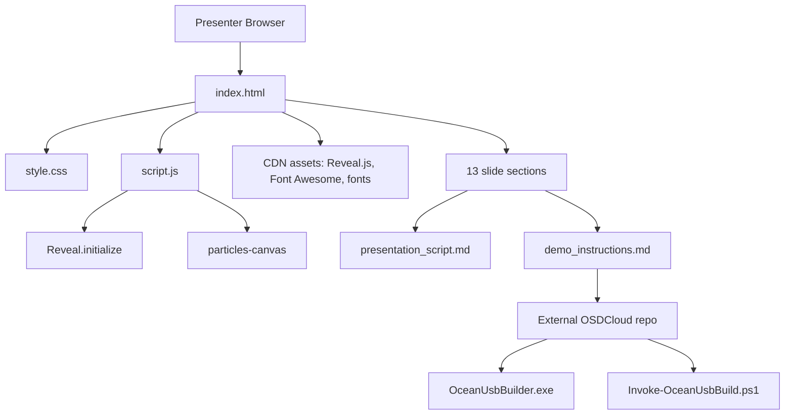
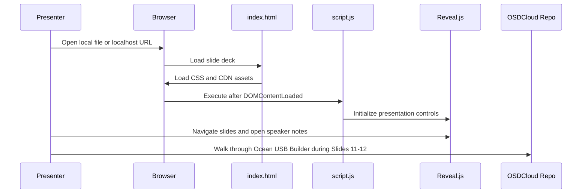

# System Architecture

> **Quick Reference**
> - **Type**: Static presentation web app.
> - **Stack**: HTML, CSS, JavaScript, Reveal.js CDN.
> - **Demo Tool**: Ocean USB Builder in local OSDCloud repo.
> - **Related**: [Data Flow](./data-flow.md), [Deployment](./deployment.md).

## Overview

The presentation repo is intentionally simple: the browser loads `index.html`, pulls external CDN assets, applies local styling from `style.css`, then runs `script.js` to initialize Reveal.js and the animated particle background.

The operational demo is external to this repo. It lives at `C:\Users\Ocean\Documents\VibeCode\OSDCloud` and is shown as a walkthrough during Slides 11-12. The demo tool combines a WPF desktop app, a PowerShell build engine, WinPE/Windows image staging, app/driver manifests and deployment scripts.

## Architecture Diagram

Text fallback: the presenter browser loads the static deck. The demo runbook points to the separate OSDCloud repo, where the WPF app calls the PowerShell build engine.

## Core Components

| Component | Description | Technology | Key Files |
|-----------|-------------|------------|-----------|
| Slide Deck | 13-slide presentation for AI Agent Playbook sharing | HTML + Reveal.js | `index.html` |
| Design System | Sea/Shopee colors, cards, layout components | CSS variables and classes | `style.css` |
| Interaction Layer | Reveal setup and particle animation | JavaScript Canvas API | `script.js` |
| Speaker Content | Slide-by-slide narration and Q&A | Markdown | `presentation_script.md` |
| Demo Runbook | Ocean USB Builder walkthrough and prompts | Markdown | `demo_instructions.md` |
| CM Documentation | Standard docs, SOPs and contracts | Markdown | `docs/` |
| External Demo Tool | WPF app plus PowerShell USB build engine | .NET WPF + PowerShell | `C:\Users\Ocean\Documents\VibeCode\OSDCloud` |

## Main Processing Flow

## Architecture Decisions

| # | Decision | Context | Status |
|---|----------|---------|--------|
| ADR-001 | Use a static Reveal.js deck | The artifact must be easy to open, present and share without backend setup. | Accepted |
| ADR-002 | Keep live demo docs separate from slide markup | Demo steps are operational and easier to rehearse from Markdown. | Accepted |
| ADR-003 | Use CDN dependencies | The project has no package manager and should stay lightweight. | Accepted |
| ADR-004 | Treat OSDCloud as read-only demo source | The presentation should document the tool without drifting or editing the tool repo. | Accepted |
| ADR-005 | Use one demo only | The user confirmed the only demo is the AI Agentic-built USB builder. | Accepted |

## Security Boundaries

The presentation repo stores no secrets. The main risk appears during the Ocean USB Builder demo: a real full build can format a USB, and manifest/package data may include sensitive operational details. Use [Tool Contracts](./api/tool-contracts.md) and [Quality Checklist](./quality-checklist.md) before presenting.

## Related

- [Analysis](./analysis.md)
- [Run Slide Deck SOP](./sop/run-slide-deck.md)
