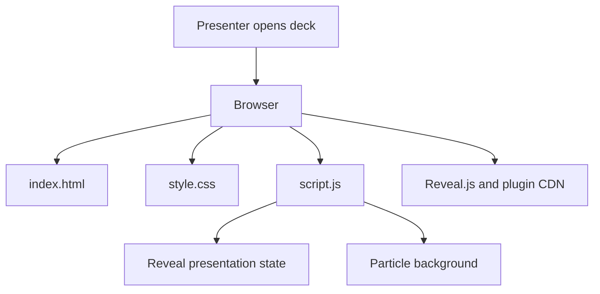
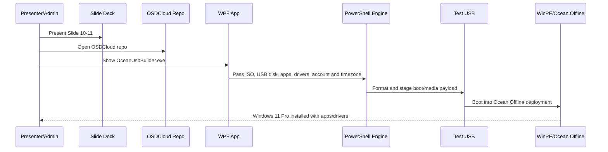

# Data Flow

> **Quick Reference**
> - **Pattern**: Static slide deck plus local operations-tool walkthrough.
> - **Protocols**: Browser asset loading, local Windows app execution, PowerShell process call.
> - **Serialization**: JSON for app manifest and build config handoff.
> - **Related**: [Tool Contracts](./api/tool-contracts.md), [Demo Catalog](./demo-catalog.md).

## Slide Runtime Flow

Text fallback: the browser loads static assets, then `script.js` initializes Reveal and the canvas animation.

## Ocean USB Builder Demo Flow

Text fallback: the presenter explains the deck, opens the OSDCloud repo, shows the WPF app, then walks through how the app hands build inputs to a PowerShell engine that prepares the bootable USB and offline deployment payload.

## Data Objects

| Object | Source | Consumer | Notes |
|--------|--------|----------|-------|
| Windows ISO path | Admin selection in WPF app | Build engine | Source for boot files and Windows 11 Pro image. |
| Target USB disk | WPF disk picker | Build engine | High-risk input because the selected disk is formatted. |
| Apps manifest | `core\ocean-offline\Apps.json` | Payload staging and install engine | Defines app installers, silent args, install order and detection rules. |
| Driver payload | Admin-selected folders/ZIP/CAB/EXE | Build engine and deploy engine | Staged into `OSDCloud\DriverPacks`. |
| Local admin/timezone | WPF app fields | Deployment scripts | Used during offline install configuration. |
| Build logs | Build engine/deploy scripts | Admin/operator | Used for rehearsal, troubleshooting and demo fallback. |

## External Boundaries

| Boundary | Direction | Data | Operational Risk |
|----------|-----------|------|------------------|
| Reveal.js CDN | Browser pulls assets | Static JS/CSS | Needs internet unless vendored. |
| Font/Icon CDN | Browser pulls assets | Static fonts/icons | Slides may look different offline. |
| OSDCloud repo | Presenter reads local files | Tool source/docs | Do not edit the tool repo while preparing presentation docs. |
| Windows USB disk | Build engine writes media | Boot files, image, apps, drivers | Full build formats the selected USB. |
| App package URLs | Manifest references packages | Installer downloads/cache | Do not expose private package URLs or enrollment payloads. |

:::warning
Use walkthrough mode by default. Switch to a real full build only when a disposable test USB is connected and the operator confirms the destructive format step.
:::

## Related

- [Architecture](./architecture.md)
- [Live Demo Ocean USB Builder SOP](./sop/live-demo-ocean-usb-builder.md)
