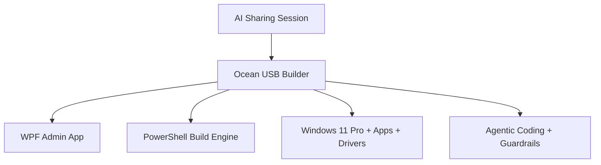

# Demo Catalog

> **Quick Reference**
> - **Total Demos**: 1 primary live demo.
> - **Primary Outcome**: Show practical AI Agentic delivery through a real operations tool.
> - **Source Runbook**: `demo_instructions.md`.
> - **Related**: [SOP Overview](./sop/index.md), [Data Flow](./data-flow.md).

## Demo Map

Text fallback: the session contains one operational demo. It walks through a real tool that prepares an offline Windows install USB and uses that tool to explain Agentic AI in practice.

## Demo: Ocean USB Builder

| Field | Detail |
|-------|--------|
| Goal | Show how AI Agentic can help build a real tool for creating a bootable Windows 11 Pro offline USB with app/driver payload. |
| Audience Pain | Team wants practical demos and wants to understand how AI moves from chatbot usage to real operational systems. |
| Tool Repo | `C:\Users\Ocean\Documents\VibeCode\OSDCloud` |
| App | `dist\OceanUsbBuilder\OceanUsbBuilder.exe` |
| Build Engine | `tools\Invoke-OceanUsbBuild.ps1` |
| Input | Windows ISO, target USB disk, offline apps, drivers, local admin account, timezone. |
| Output | Bootable USB with WinPE/Ocean Offline flow, Windows 11 Pro image, apps and driver payload. |
| Success Signal | Audience sees GUI, manifest, engine and safety guardrails without accidental USB formatting. |
| SOP | [Live Demo Ocean USB Builder](./sop/live-demo-ocean-usb-builder.md) |

## Media Proof Assets

| Asset | Path | Purpose |
|-------|------|---------|
| Live build screenshot | `assets/images/ocean-usb-builder-live-build.png` | Shows Ocean USB Builder actively building USB media. |
| USB install video | `assets/videos/ocean-usb-install-windows.mp4` | Shows the created USB booting/cài Windows. |
| Optional video poster | `assets/images/ocean-usb-install-poster.png` | Static poster shown before the video plays. |

## Rehearsal Order

1. Open the deck and verify the cover, slides 1, 2, 3, 6, 7, 8, 9, 10, 11, 12 and final Q&A.
2. Open speaker view with `S`.
3. Rehearse the playbook arc: AI update, prompt, skill ecosystem, workflow and guardrails.
4. Rehearse the Ocean USB Builder screenshot/video proof sequence.
5. Keep `Apps.json`, build engine and docs ready as backup, then return to Q&A about prompt, Agentic Coding and guardrails.

:::warning
Do not run a full USB build during the live session unless a disposable test USB is already selected and the presenter explicitly confirms formatting.
:::

## Related

- [Tool Contracts](./api/tool-contracts.md)
- [Quality Checklist](./quality-checklist.md)
