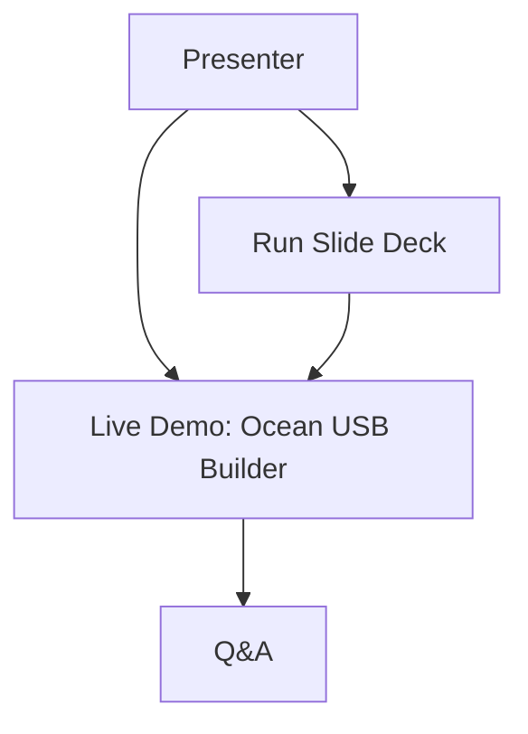

# SOP Overview

> **Quick Reference**
> - **Total SOPs**: 2.
> - **Role**: Presenter hoặc demo operator.
> - **Difficulty**: Easy to medium.
> - **Related**: [Demo Catalog](../demo-catalog.md), [Quality Checklist](../quality-checklist.md).

## Feature Map

Text fallback: the presenter verifies the slide deck, runs one Ocean USB Builder walkthrough, then uses Q&A to discuss prompt, Agentic Coding and operational guardrails.

## SOP List

| No. | SOP | Description | Time |
|-----|-----|-------------|------|
| 1 | [Run Slide Deck](./run-slide-deck.md) | Open, navigate and verify the Reveal.js presentation. | 5-10 min |
| 2 | [Live Demo Ocean USB Builder](./live-demo-ocean-usb-builder.md) | Walk through the AI Agentic-built Windows USB builder tool safely. | 12-18 min |

## Recommended Rehearsal

1. Run [Quality Checklist](../quality-checklist.md).
2. Practice [Run Slide Deck](./run-slide-deck.md).
3. Practice [Live Demo Ocean USB Builder](./live-demo-ocean-usb-builder.md).
4. Prepare one fallback path: screenshots/logs/docs if the app cannot be opened live.

## Related

- [Deployment](../deployment.md)
- [Tool Contracts](../api/tool-contracts.md)
