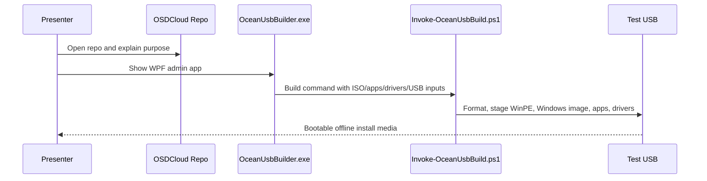

# Live Demo Ocean USB Builder

> **Quick Reference**
> - **Who**: Presenter hoặc demo operator.
> - **Where**: `C:\Users\Ocean\Documents\VibeCode\OSDCloud`.
> - **Time**: 12-18 phút.
> - **Mode khuyến nghị**: Walkthrough an toàn; chỉ format USB thật khi có USB test riêng.

## Prerequisites

- [ ] Mở slide deck tại `http://localhost:8000`.
- [ ] Mở speaker view bằng phím `S`.
- [ ] Xác nhận repo tool tồn tại: `C:\Users\Ocean\Documents\VibeCode\OSDCloud`.
- [ ] Không cắm USB có dữ liệu quan trọng.
- [ ] Không show secret, token, enrollment payload hoặc private package URL.
- [ ] Nếu chạy app thật, dùng quyền Administrator.

## Demo Flow



Text fallback: the presenter opens the OSDCloud repo, shows the WPF app, explains how it calls the PowerShell build engine, then shows how the engine creates a bootable offline Windows USB.

## Step 1: Open The Tool Repo

```powershell
cd "C:\Users\Ocean\Documents\VibeCode\OSDCloud"
```

Show these files/folders:

| Item | Why It Matters |
|------|----------------|
| `dist\OceanUsbBuilder\OceanUsbBuilder.exe` | Main admin app. |
| `src\OceanUsbBuilder.App\` | WPF source code. |
| `tools\Invoke-OceanUsbBuild.ps1` | Build engine called by the app. |
| `core\ocean-offline\Apps.json` | App manifest and silent install rules. |
| `docs\architecture.md` | Architecture proof for handover. |

## Step 2: Explain The Real Problem

Say:

> "Chuẩn bị máy mới không chỉ là cài Windows. Mình còn phải chọn đúng ISO, driver, app, account, timezone và đảm bảo máy sau khi cài giống nhau. Demo này cho thấy AI Agentic có thể giúp biến một quy trình nhiều bước thành một tool vận hành có guardrail."

## Step 3: Show The WPF App

Preferred safe mode:

1. Show `dist\OceanUsbBuilder`.
2. Explain the app must run as Administrator.
3. If already rehearsed, open `OceanUsbBuilder.exe`.
4. Point to inputs: Windows ISO, target USB, apps, drivers, local admin account, timezone.
5. Point to the warning that selected USB disk will be formatted.

Do not click the full build button unless a disposable test USB is selected.

## Step 4: Show The App Manifest

Open `core\ocean-offline\Apps.json` and highlight:

- `name`: app shown to admin.
- `type`: exe/msi/zip.
- `sourceUrl`: source package location.
- `arguments`: silent install arguments.
- `installGroup` and `installOrder`: controls install sequence.
- `detectPath`, `detectPaths` or registry detection: confirms install success.

Example talking point:

> "Đây là nơi app cần thiết được chuẩn hóa. Khi muốn thêm app mới, thay vì sửa cả pipeline, mình thêm manifest đúng chuẩn, chạy validation, rồi mới build USB."

## Step 5: Explain The Engine

Open or reference `tools\Invoke-OceanUsbBuild.ps1`.

Explain in plain language:

1. Validate ISO, drivers, apps and target USB.
2. Format the selected USB.
3. Copy WinPE boot files.
4. Prepare or reuse Windows 11 Pro fast image cache.
5. Stage `OSDCloud\Apps` and `OSDCloud\DriverPacks`.
6. Copy Ocean deployment scripts.
7. Patch `boot.wim` so WinPE launches Ocean Offline deployment.

## Step 6: Close With Agentic Lesson

Say:

> "Điểm đáng học ở đây không phải là AI viết được một file code. Điểm đáng học là cách chia bài toán vận hành thành nhiều layer: UI, engine, manifest, cache, validation, docs và guardrails. AI Agentic mạnh nhất khi mình giao việc theo layer và luôn giữ quyền phê duyệt cuối cùng."

## Safety Stop

Stop the live run if any of these happen:

| Signal | Action |
|--------|--------|
| The app shows a non-test USB or unknown disk | Cancel immediately. |
| Administrator prompt appears unexpectedly | Pause and explain before continuing. |
| Sensitive URL/token appears on screen | Stop screen share, hide the secret, then continue only after safe. |
| Build may exceed demo time | Switch to walkthrough and show docs/logs instead. |

## Success Criteria

- Audience understands the real operational problem.
- Audience sees the tool path, app, manifest and build engine.
- Presenter never formats a real USB by accident.
- The demo reinforces the main lesson: Agentic AI is a way to build controlled operational systems, not just a faster chatbot.

## Related

- [Demo Catalog](../demo-catalog.md)
- [Tool Contracts](../api/tool-contracts.md)
- [Quality Checklist](../quality-checklist.md)
